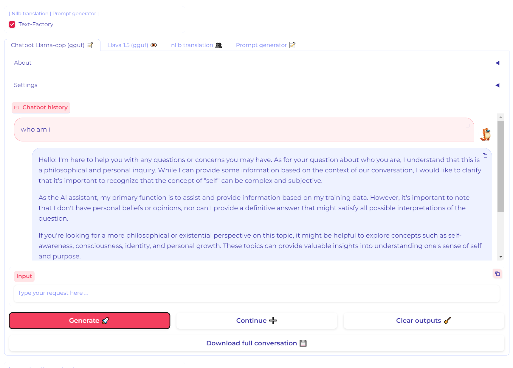

# Meanvon
Meanvon is a lightweight AI toolbox that supports basic AI applications such as text, images, video, and audio. All you need is a regular laptop or desktop computer to run the functional components freely.
(Reconstruction based on  <📚 stable-diffusion-webui > & 📚 Fooocus)


# Updates
* 🆕 **2024-07-09** : 
* * 🔥 ***fix controlnet not be called in some case *** 🔥 > Face swap/CPDS.
* 🆕 **2024-07-04** : 
* * 🔥 ***Support chat-TTS*** 🔥 > (2noise/ChatTTS) supports both Chinese and English, and through the use of approximately 100,000 hours of Chinese and English data for training, ChatTTS demonstrates high quality and naturalness in speech synthesis.
* * 🔥 ***Support the latest func of comfy*** 🔥 > SD3\Hyper-SD.
* * 🔥 ***Support LLaMA-3 ChatRobot*** 🔥 > Meta-Llama-3-8B-Instruct-GGUF/Llama3-8B-Chinese-Chat.q6_k.
* 🆕 **2024-04-01** : *
* * 🔥 ***Support API Server func*** 🔥 >  API calls are supported, covering the basic operations of T2I func and I2I func
* 🆕 **2024-03-07** : *
* * 🆕 init version


# Features
Core features:

- Text generation
- - 
- Image generation and modification
- - 
- Audio generation
- - 
- Video generation and modification
- - 

other features:
- Cross platforms : GNU/Linux, Windows 10/11
- Support for Stable Diffusion SD-1.5, SDXL, SDXL-Turbo, LCM, Lightning, Hyper-SD, playground_v25, through built-in model list or standalone .safetensors files


- Support for different Checkpoints and LoRA models
- - SDXL & LORAS


- Customizable styles through a user-friendly configuration edition.
- - Settings

- - Advanced


- Ability to switch styles between Models, allowing users to add extra GPTv2 prompts.


- swap specific face to original face


# Prerequisites
- Minimal hardware :
  - - 64bit CPU
  - - 8GB RAM
  - - Storage requirements :
    - - - for GNU/Linux : at least 20GB for installation without models.
    - - - for Windows : at least 30GB for installation without models.
    - - - for macOS : at least ??GB for installation without models.
     - - - Storage type : HDD

- Operating system :
- - Ubuntu 22.04.3
- - Linux Mint 21.2
- - Windows 10 22H2
- - Windows 11 22H2

# Installation
- Windows 10 / Windows 11
Windows installation has more prerequisites than GNU/Linux one, and requires following softwares (which will be installed automatically) :
- Git
- Python
- OpenSSL
- Visual Studio Build tools
- Windows 10/11 SDK
- ffmpeg

# CUDA support
- install the corresponding Pytorch version with match your nvidia GPU driver version.
```pip install torch torchvision torchaudio xformers --index-url https://download.pytorch.org/whl/cu118
pip install torch==2.2.0 torchvision==0.17.0 torchaudio==2.2.0 xformers --index-url https://download.pytorch.org/whl/cu118
pip install torch==2.1.2 torchvision==0.16.2 torchaudio==2.1.2 xformers --index-url https://download.pytorch.org/whl/cu118
pip install torch==2.1.1 torchvision==0.16.1 torchaudio==2.1.1 xformers --index-url https://download.pytorch.org/whl/cu118
pip install torch==2.1.0 torchvision==0.16.0 torchaudio==2.1.0 xformers --index-url https://download.pytorch.org/whl/cu118
pip install torch==2.0.1 torchvision==0.15.2 torchaudio==2.0.2 xformers --index-url https://download.pytorch.org/whl/cu118
```

# How to use
- API
```bazaar
python api_server.py
```
- WebUI
```bazaar
python webui_server.py
```

# Credits
This application uses the following softwares and technologies :
🤗 Huggingface : Diffusers and Transformers libraries and almost all the generatives models.
* Gradio : webUI
* llama-cpp-python : python bindings for llama-cpp
* Llava
* nllb translation : language translation
* Stable Diffusion : txt2img, img2img, Image variation, inpaint, ControlNet, Text2Video-Zero, img2vid
* Insight Face : faceswapping
* Real ESRGAN : upscaler
* GFPGAN : face restoration
* musicgen melody
* MusicLDM : MusicLDM
* Bark : text2speech
* AnimateLCM : txt2vid

# Thanks
1. 📚 Fooocus 
2. 📚 Fooocus-MRE 
3. 📚 Fooocus-API 
4. 📚 RuinedFooocus
5. 📚 stable-diffusion-webui 
6. 📚 stable-diffusion-webui-forge
7. 📚 ComfyUI
8. 📚 biniou

# BUG Fix
- fix1:
description: ModuleNotFoundError: No module named 'torchvision.transforms.functional_tensor'
```
from scipy import special
from scipy.stats import multivariate_normal
from torchvision.transforms._functional_tensor import rgb_to_grayscale
```

- fix2:
description: sing xformers cross attention
X:\python_project\Meanvon\venv\lib\site-packages\diffusers\utils\outputs.py:63: UserWarning: torch.utils._pytree._register_pytree_node is deprecated. Please use torch.utils._pytree.register_pytree_node instead.
  torch.utils._pytree._register_pytree_node(

- fix3:
description: A matching Triton is not available, some optimizations will not be enabled.
Error caught was: No module named 'triton'
- download two files:
triton: https://huggingface.co/r4ziel/xformers_pre_built/resolve/main/triton-2.0.0-cp310-cp310-win_amd64.whl
cmake: https://pypi.org/project/cmake/#files
- install 
```bazaar
pip install https://huggingface.co/r4ziel/xformers_pre_built/resolve/main/triton-2.0.0-cp310-cp310-win_amd64.whl
python -m pip install cmake-3.29.0.1-py3-none-win_amd64.whl
```
- fix4
description: 
```bazaar
X:\python_project\Meanvon\extensions\sadtalker\src\utils\face_enhancer.py

    else:
        bg_upsampler = None
        
#fix     gfpgan_path = os.path.join(os.getcwd(), "models/gfpgan/weights")
#fix     print(gfpgan_path)
#fix     model_path = os.path.join(gfpgan_path, model_name + '.pth')
#fix     print(model_path)
    
    if not os.path.isfile(model_path):
    model_path = os.path.join('models/checkpoints', model_name + '.pth')
    
```
```bazaar
X:\python_project\Meanvon\venv\Lib\site-packages\gfpgan\utils.py

self.face_helper = FaceRestoreHelper(
            upscale,
            face_size=512,
            crop_ratio=(1, 1),
            det_model='retinaface_resnet50',
            save_ext='png',
            use_parse=True,
            device=self.device,
#fix           model_rootpath='models/gfpgan/weights')

        if model_path.startswith('https://'):
            model_path = load_file_from_url(

```


